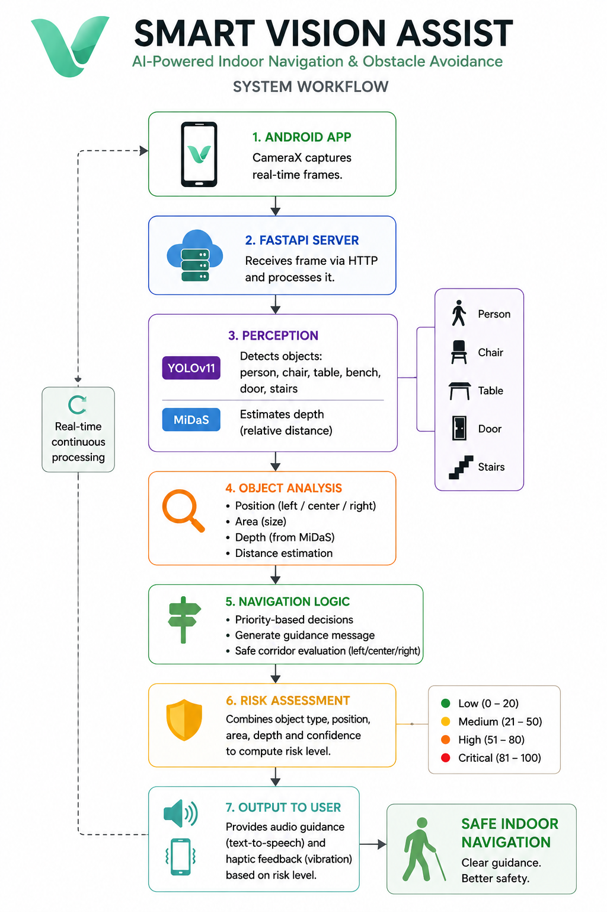
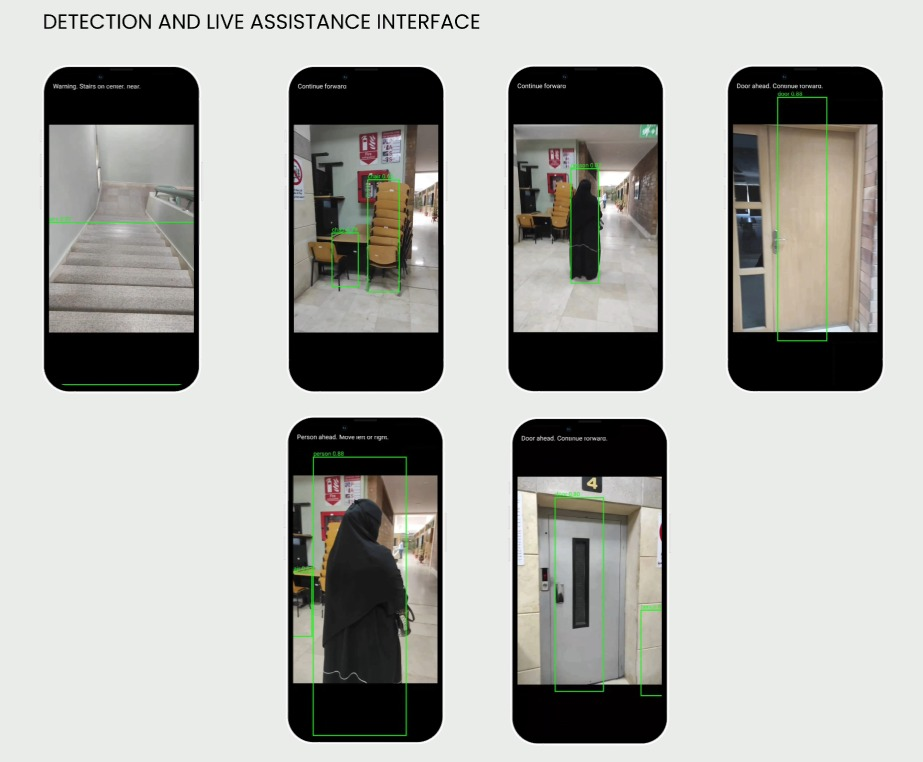
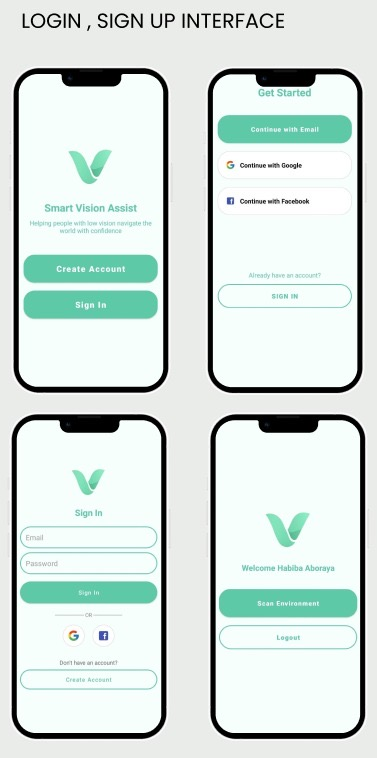

# Smart Vision Assist

An AI-powered indoor navigation system designed to assist visually impaired users through real-time object detection, relative depth estimation, and intelligent navigation guidance.

This project was developed as a graduation project at the **Arab Academy for Science, Technology and Maritime Transport (AASTMT)**.

---

## Project Overview

Smart Vision Assist combines Artificial Intelligence and Android development to improve indoor mobility for visually impaired users.

The system captures live camera frames from an Android application, sends them to a FastAPI backend, detects surrounding objects using YOLOv11, estimates their relative depth using MiDaS, evaluates their risk level, and returns navigation guidance to the user.

---

## Key Features

- Real-time indoor object detection
- Relative depth estimation
- Multi-factor risk assessment
- Navigation guidance generation
- Android mobile application
- FastAPI backend server
- Firebase Authentication
- Voice navigation support
- OCR support (planned)

---

## System Architecture



---

## Detection Results

The backend detects indoor objects and combines object detection with relative depth estimation to improve navigation decisions.



---

## Android Application

The Android application provides:

- User authentication using Firebase
- Live camera interface
- Communication with the FastAPI backend
- Voice guidance for navigation
- User-friendly interface

### Application Screens



---

## Repository Structure

```text
SmartVisionAssist/
│
├── Android/
│   ├── app/
│   ├── assets/
│   ├── gradle/
│   └── Android Studio project
│
├── Backend/
│   ├── models/
│   ├── navigation_server.py
│   ├── navigation_engine.py
│   ├── depth_helper.py
│   ├── requirements.txt
│   └── README.md
│
├── Documentation/
│   ├── Graduation_Report.pdf
│   ├── Presentation.pdf
│   └── images/
│
└── README.md
```

---

## Technologies Used

### Backend

- Python
- FastAPI
- YOLOv11 (Ultralytics)
- MiDaS
- OpenCV
- PyTorch
- NumPy

### Android

- Kotlin
- Android Studio
- CameraX
- Firebase Authentication
- Material Design

---

## AI Pipeline

1. Capture a live image using the Android application.
2. Send the image to the FastAPI backend.
3. Detect indoor objects using YOLOv11.
4. Estimate relative depth using MiDaS.
5. Calculate object risk using multiple factors.
6. Generate navigation guidance.
7. Return the result to the Android application.

---

## Documentation

The repository includes:

- Graduation Report
- Project Presentation
- System Workflow
- Detection Results
- Android Application Screens

---

## Future Work

- Improve object detection accuracy
- Enhance depth estimation performance
- Add OCR for room numbers and signs
- Support outdoor navigation using GPS
- Conduct real-world evaluation with visually impaired users

---

## Author

**Habiba Abouraya**

Computer Science Student

Arab Academy for Science, Technology and Maritime Transport (AASTMT)

GitHub: https://github.com/HabibaAboraya

---

## Backend Repository

The backend implementation is also available as a standalone repository:

**IndoorNavigator-Server**

https://github.com/HabibaAboraya/IndoorNavigator-Server
